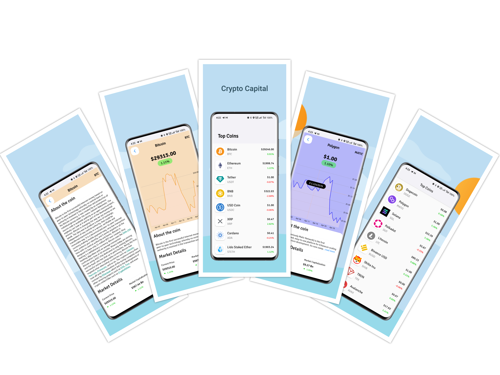
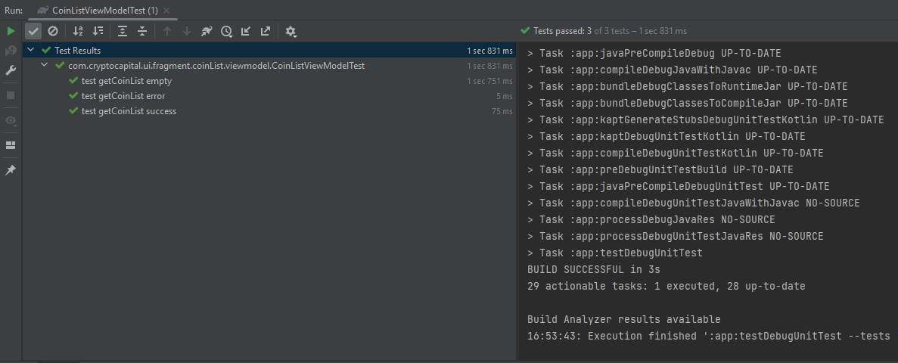
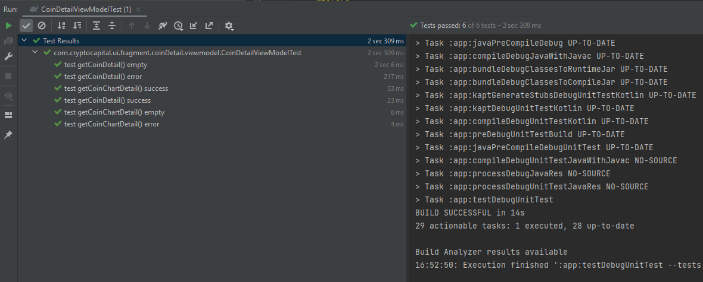
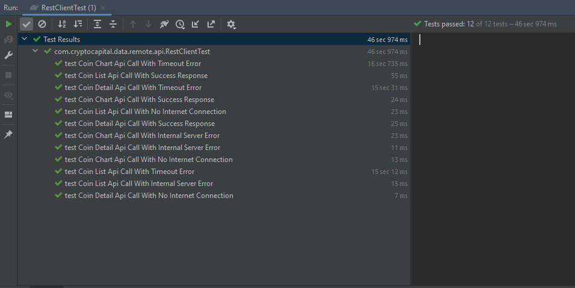
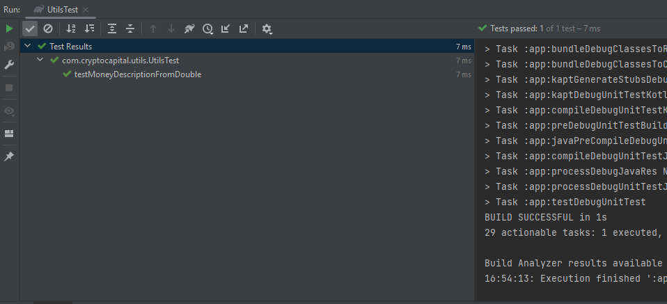

# Crypto Capital - MVVM pattern kotlin
The Crypto Capital - App consuming a [CoinGecko API](https://www.coingecko.com/en/api) to display top 100 crypto coins it has been built with implementation of the Model-View-ViewModel (MVVM) architecture pattern in Kotlin. It demonstrates how to separate concerns between the UI, business logic, and data layers to create a maintainable, scalable, and testable application.

This app also shows the usage of the Navigation Architecture Component.

**App features:**
- List of Top 100 Crypto Coins
- Detail of Coins
- Price changes of coin in a graph

## Screenshots

## Architecture
The MVVM architecture pattern is a way of separating the concerns of the UI, business logic, and data layers. The goal of MVVM is to create a maintainable, scalable, and testable application by isolating each layer and making it easy to swap out components.

## Modules:
* **ui** - It uses all the components and classes releated to Android Framework.
* **data** - The data layer contains the *remote* module to get data from web server using retrofit and the *repository* module which acts as a mediator between the ViewModel and the data sources (such as a database or web service).
* **base** - the base module contains *Base Fragment*, *Base ViewModel* and *Base Adapter* to reduce the code duplication
* **di** - It contains `Koin` modules for dependency injection.
* **extensions** - Kotlin extensions to reduce boilerplate code.
* **model** - Contains all the Data Class (POJO)
* **utils** - Utiliy Classes like App Constant and Custom functions

## Module Structure

    com.cryptocapital     # Root Package
    .
    ├── base
    |   ├── base fragment       # For reducing duplicate code in fragments.
    |   ├── base adapter        # For reducing duplicate code in adapters.
    |   └── base viewmodel      # For reducing duplicate code in viewmodels. 
    |
    ├── data                    # For data handling.
    │   ├── resource            # Resource class to handle the different possible outcomes
    │   ├── remote              # Remote Data Handlers     
    |   │   ├── api             # Retrofit API for remote end point.
    │   └── repository          # Single source of data.
    |
    ├── di                  
    │   └── koin modules        # for dependency injection 
    |
    ├── extensions                  
    │   └── context extension   # extensions classes to reduce boiler code
    |
    ├── model                  
    │   └── data class          # POJO classes
    | 
    ├── ui  
    |   ├── activity            # Activities in the apps
    |   |   ├── main            # Main Activity 
    |           ├── adapter     # Adapters used in main activity
    |           └── viewmodel   # View Models used in main activity 
    |   ├── fragment            # Fragments in the apps
    |   |   ├── coinlist        # Coin List Fragment 
    |           ├── adapter     # Adapters used in Coin List Fragment
    |           └── viewmodel   # View Models used in Coin List Fragment
    |
    └── utils                   # Utility Classes

## Built With 🛠
- [Kotlin](https://kotlinlang.org/) - First class and official programming language for Android development.
- [Coroutines](https://kotlinlang.org/docs/reference/coroutines-overview.html) - For asynchronous and more..
- [Android Architecture Components](https://developer.android.com/topic/libraries/architecture) - Collection of libraries that help you design robust, testable, and maintainable apps.
    - [LiveData](https://developer.android.com/topic/libraries/architecture/livedata) - Data objects that notify views when the underlying database changes.
    - [ViewModel](https://developer.android.com/topic/libraries/architecture/viewmodel) - Stores UI-related data that isn't destroyed on UI changes.
    - [ViewBinding](https://developer.android.com/topic/libraries/view-binding) - Generates a binding class for each XML layout file present in that module and allows you to more easily write code that interacts with views.
- [Koin](https://insert-koin.io) - Dependency Injection Framework
- [Retrofit](https://square.github.io/retrofit/) - A type-safe HTTP client for Android and Java.
- [GSON](https://github.com/google/gson) - A Java serialization/deserialization library to convert Java Objects into JSON and back.
- [GSON Converter](https://github.com/square/retrofit/tree/master/retrofit-converters/gson) - A Converter which uses Gson for serialization to and from JSON.
- [OkHttp3](https://github.com/square/okhttp) -  For implementing interceptor, logging and mocking web server.
- [Glide](https://github.com/bumptech/glide) - An image loading and caching library for Android focused on smooth scrolling.
- [MP Chart](https://github.com/PhilJay/MPAndroidChart) - A powerful & easy to use chart library for Android
- [Material Components for Android](https://github.com/material-components/material-components-android) - Modular and customizable Material Design UI components for Android.
- [Mockito-Kotlin](https://github.com/nhaarman/mockito-kotlin) for mocking in tests.
- [MockWebServer](https://github.com/square/okhttp/tree/master/mockwebserver) for Instrumentation tests.
- [AndroidX Test Library](https://github.com/android/android-test) for providing JUnit4 and functions as `launchActivity` in UI tests

## Unit Testing
Covered Coin List ViewModel, Coin Detail ViewModel, Rest Client and Utility Class Testing.

- ### CoinListViewModel Unit Test
    
- ### CoinDetailViewModel Unit Test
    
- ### RestClient Unit Test
    
- ### Utility Class Unit Test
    